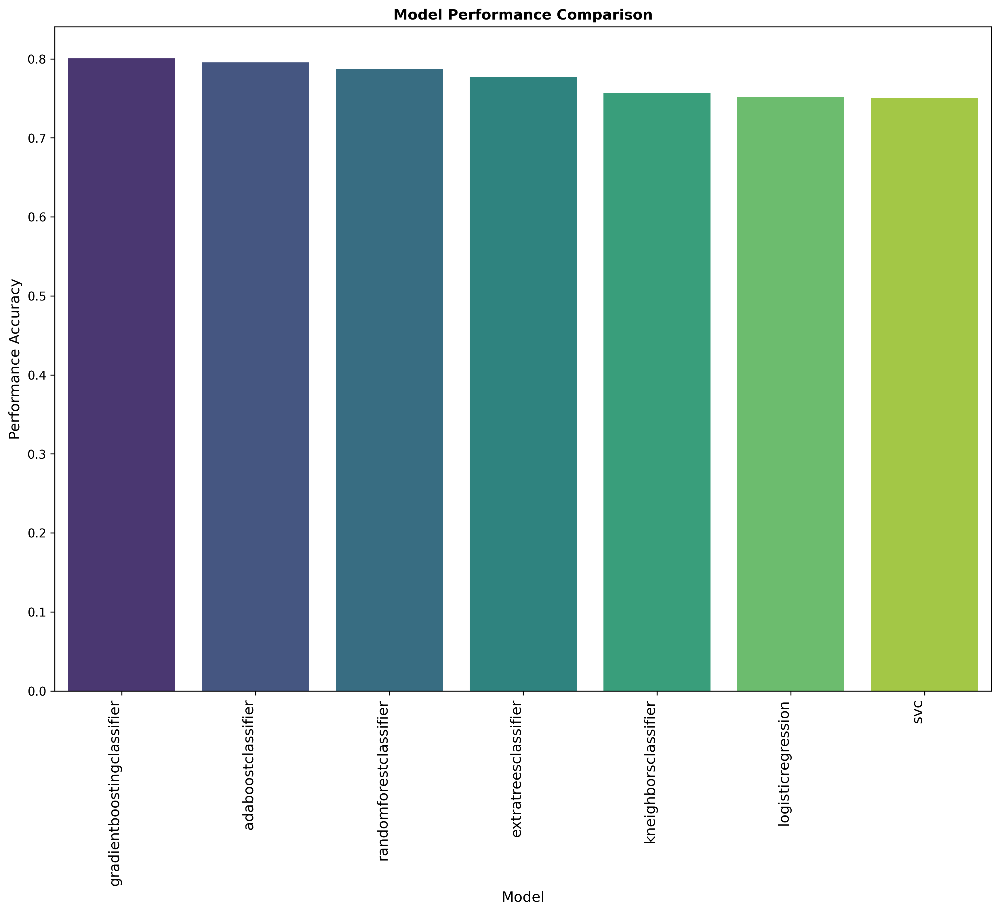

# Data Science and Machine Learning in Python

This repository features a collection of data science and machine learning projects implemented in Python, developed during my free time as supplementary coursework while studying at the University of Alabama. These projects span a broad spectrum of topics, including Exploratory Data Analysis (EDA), supervised learning techniques such as linear regression, logistic regression, decision trees, random forests, support vector machines, k-nearest neighbors, and ensemble methods, as well as unsupervised learning techniques like clustering and Principal Component Analysis (PCA).

The capstone project focuses on an independent analysis of customer churn in the internet service industry, where I conducted various data analyses to identify the factors contributing to customer churn and developed predictive models to pinpoint customers at risk of leaving. For more details, refer to [churn analysis notebook](./churn_analysis_project/churn_predictive_analysis.ipynb).

## Highlights

### Predicting Customer Churn in the Internet Service Industry
 I performed an exploratory data analysis (EDA) to identify key factors driving customer churn in the internet service industry. Following the EDA, I developed predictive models using several machine learning classification algorithms, including Random Forest, Logistic Regression, and Boosted Trees, to identify customers at risk of leaving. I also applied grid search for hyperparameter tuning to enhance model accuracy. Finally, I utilized a voting classifier ensemble method to combine the predictions from multiple models, resulting in improved overall predictive performance for deployment. Below are brief plots showing the accuracy of the models in predicting churn.

  

the above plot show that boosted trees have slightly better performance compared to other models.

Moreover using this, I have also identified the most important features that contribute to customer churn as shown below.

  

### Outlier Detection Using DBSCAN in Grocery Purchases Dataset
In [this project](./dbscan_outlier_detection/dbscan_grocery_outlier.ipynb), I implemented the Density-Based Spatial Clustering of Applications with Noise (DBSCAN) algorithm to identify outliers within a grocery purchases dataset. The DBSCAN algorithm is particularly well-suited for this task as it can detect outliers based on the density of data points, which is crucial in datasets where clusters of varying densities are present.

To ensure optimal performance, I fine-tuned the hyperparameters of the DBSCAN algorithm, such as the minimum number of samples required to form a dense region and the maximum distance between two samples for one to be considered as in the neighborhood of the other (epsilon). This tuning process significantly improved the algorithm's ability to accurately identify outliers, which are data points that do not belong to any cluster.

Below is a visualization of the detected outliers in a simple two-dimensional feature plot.

  

This plot demonstrates that the DBSCAN algorithm successfully identified two distinct clusters within the dataset and isolated the outliers, which are the points that lie outside these clusters. 

Using this, I also have compared varaious features within these clusters to understand the purchasing behavior of these clusters as shown below.

  

This normalized heatmap show that the outlier have very high feature values compared to the other clusters.

## Other samll projects
During my learning process, I have also implemented various machine learning algorithms espcially unsupervised learning techniques like clustering and PCA on synthetic datasets which are found in the [additional projects](./additional_small_projects/) folder. Feel free to explore these projects as well.
